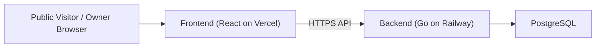
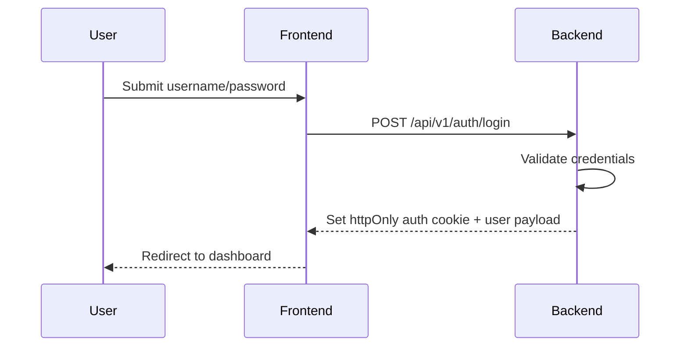
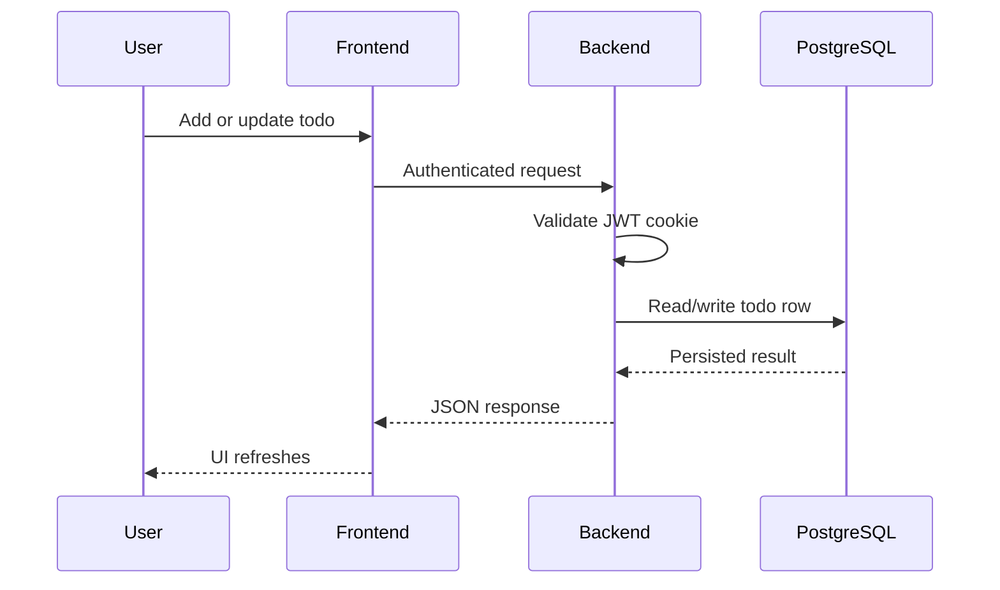

# Personal Digital Hub MVP 1 Architecture

## 1. Architecture Summary

MVP 1 uses a split-application architecture:

- a React frontend deployed to Vercel
- a Go backend deployed to Railway
- a PostgreSQL database used by the backend

Both frontend and backend follow a modular monolith structure. Each application
is deployed as a single unit, but its code is divided by domain boundaries to
keep future modules isolated and maintainable.

## 2. Architecture Goals

- keep the first production release simple to build and operate
- provide a stable base for future modules
- separate public and private experiences cleanly
- minimize premature infrastructure complexity
- preserve a path to introduce specialized services later

## 3. High-Level System Diagram



## 4. Frontend Architecture

### 4.1 Application Areas

The frontend has two top-level areas:

- public area
- private dashboard area

Public area:

- landing page
- project highlights
- contact links

Private area:

- login page
- authenticated dashboard shell
- journal module
- todo module
- placeholder routes for future modules

### 4.2 Frontend Technology Recommendation

- React
- TypeScript
- Vite
- React Router
- TanStack Query
- React Hook Form
- Zod
- Tailwind CSS
- Radix UI

### 4.3 Frontend Module Layout

```text
chidinh_client/
  src/
    app/
      router/
      providers/
      layouts/
    modules/
      auth/
      portfolio/
      dashboard/
      journal/
      todo/
    shared/
      api/
      ui/
      hooks/
      lib/
      types/
      constants/
    assets/
```

### 4.4 Frontend Responsibilities

`app/`
- bootstrap application
- define route tree
- register global providers

`modules/auth/`
- login page
- auth session hooks
- route guard logic

`modules/portfolio/`
- static data source
- public landing UI

`modules/dashboard/`
- dashboard layout
- sidebar and topbar

`modules/journal/`
- watch/read diary screen
- create and edit form
- image upload and card list

`modules/todo/`
- todo list screen
- create form
- item actions

`shared/api/`
- API client
- auth-aware fetch configuration

## 5. Backend Architecture

### 5.1 Service Model

Backend MVP 1 is a single Go service. It includes all current business modules:

- auth
- session
- journal
- todo
- health/config bootstrap

The service owns all HTTP APIs, authentication logic, and PostgreSQL access.

### 5.2 Backend Technology Recommendation

- Go
- `net/http`
- `chi`
- `pgx v5`
- `sqlc`
- `goose`
- `log/slog`
- `go-playground/validator/v10`

### 5.3 Backend Module Layout

```text
chidinh_api/
  cmd/
    api/
      main.go
  internal/
    app/
      bootstrap.go
    platform/
      config/
      database/
      httpserver/
      logger/
      middleware/
    modules/
      auth/
        handler.go
        service.go
        types.go
      journal/
        handler.go
        service.go
        repository.go
        types.go
      todo/
        handler.go
        service.go
        repository.go
        types.go
    generated/
      db/
  db/
    migrations/
    queries/
```

### 5.4 Backend Responsibilities

`platform/config`
- read environment variables
- validate required settings

`platform/database`
- initialize pgx pool
- expose database dependencies

`platform/middleware`
- request logging
- panic recovery
- auth enforcement
- CORS

`modules/auth`
- login
- logout
- session inspection
- JWT issuance and verification

`modules/journal`
- CRUD operations for book/video diary entries
- owner-only image upload handling
- owner-only data access

`modules/todo`
- CRUD operations
- input validation
- owner-only data access

`db/migrations`
- schema management

`db/queries`
- sqlc SQL source files

## 6. Authentication Design

### 6.1 MVP 1 Auth Model

The system supports exactly one owner account. Credentials are configured outside
the public UI. No registration flow exists.

### 6.2 Token Strategy

The backend generates a signed JWT after successful login. The JWT is sent to the
browser via an `httpOnly` cookie.

Recommended cookie settings in production:

- `HttpOnly=true`
- `Secure=true`
- `SameSite=None` if frontend and backend run on different origins and cross-site
  cookies are required
- explicit `Domain` only if deployment domain strategy requires it

### 6.3 Session Endpoints

- `POST /api/v1/auth/login`
- `POST /api/v1/auth/logout`
- `GET /api/v1/auth/me`

### 6.4 Route Protection

Frontend route guards should check session state using `GET /api/v1/auth/me`.
Backend middleware is the source of truth for protected access.

## 7. Data Flow

### 7.1 Login Flow



### 7.2 Todo Flow



## 8. Database Design Principles

- PostgreSQL is the single source of truth for authenticated tool data.
- Portfolio content remains in frontend source code and does not live in the
  database for MVP 1.
- Database design should preserve a clear owner boundary even though only one
  account exists initially.
- Schema should be simple and migration-driven.

## 9. Deployment Architecture

### 9.1 Frontend

- deploy on Vercel
- build from `chidinh_client`
- environment variables:
  - `VITE_API_BASE_URL`

### 9.2 Backend

- deploy on Railway
- build from `chidinh_api`
- environment variables:
  - `APP_ENV`
  - `PORT`
  - `DATABASE_URL`
  - `JWT_SECRET`
  - `OWNER_USERNAME`
  - `OWNER_PASSWORD_HASH` or equivalent credential source
  - `CORS_ALLOWED_ORIGINS`

### 9.3 CI/CD

GitHub Actions should:

- install frontend dependencies
- run frontend tests and build
- install backend tooling and dependencies
- run backend tests
- build backend binary or image
- trigger deployment to Vercel and Railway

## 10. Future Expansion Path

This architecture is intentionally prepared for later modules:

- `notes`
- `files`
- `calendar`
- `search`
- `assistant`

If any future module requires different scaling or a different runtime, it can be
extracted into a specialized service. Examples include AI pipelines, OCR, or
search indexing workers.

## 11. Key Technical Decisions

### Decision 1: Split frontend and backend deployments

Reason:
- clear separation of concerns
- aligns with chosen platforms
- keeps backend independent from frontend runtime constraints

### Decision 2: Single Go backend service

Reason:
- lower operational complexity
- easier local development
- sufficient for MVP 1

### Decision 3: Static portfolio content

Reason:
- fastest path to production
- no CMS complexity in MVP 1
- no dependency on backend content APIs

### Decision 4: Todo as first private tool

Reason:
- validates end-to-end CRUD
- exercises auth, routing, state management, API, and database integration
- small enough to implement quickly without distorting the architecture
